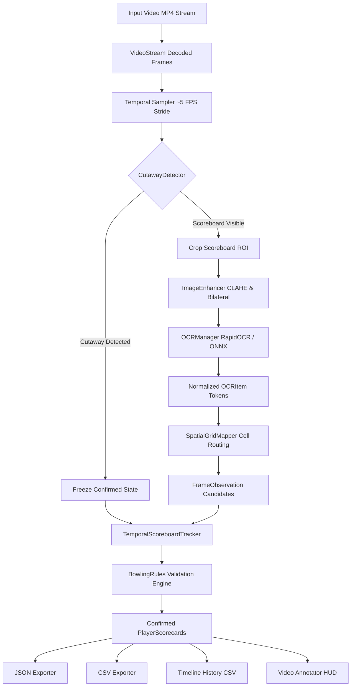
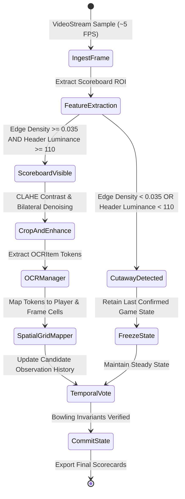
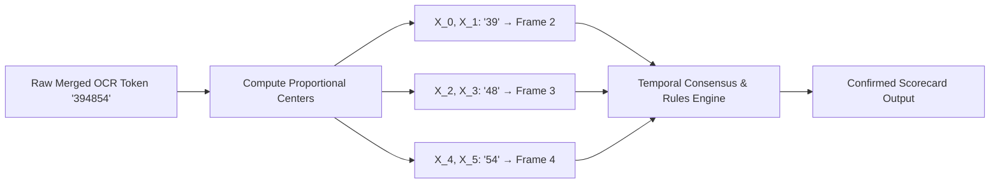
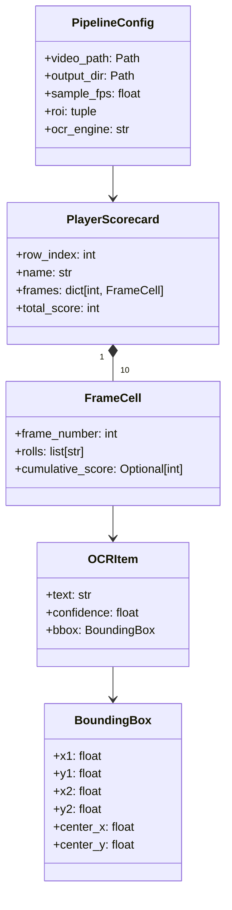
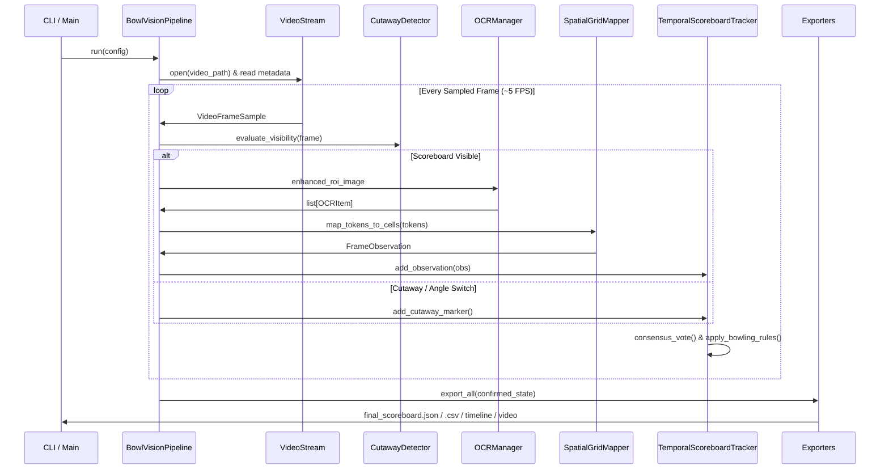

# BowlVision: Automated Bowling Scoreboard Extraction

[](https://www.python.org/)
[]()
[](https://opencv.org/)
[](https://github.com/RapidAI/RapidOCR)
[]()

**BowlVision** is a robust computer-vision and temporal OCR analytics pipeline engineered to extract structured, machine-readable bowling game data from unstructured sports broadcast footage. Live electronic bowling scoreboards present numerous real-world computer vision challenges: camera angle cutaways to bowlers and pin decks, motion blur during pan/zoom transitions, LED matrix glare, small segmented fonts, and merged multi-digit bounding boxes.

This repository was developed for the **FOG Technologies Computer Vision Engineer Assessment**.

---

## 👤 Candidate Details

| Field | Details |
| :--- | :--- |
| **Candidate Name** | **Bhavesh Barmashe** |
| **Institute** | Sagar Institute of Research and Technology (SIRT), Bhopal |
| **Target Role / Assessment** | FOG Technologies — Computer Vision Engineer Assessment |
| **Project Name** | BowlVision: Automated Bowling Scoreboard Extraction Pipeline |
| **Domain** | Computer Vision, Deep Learning OCR, Sports Broadcast Analytics |
| **Submission Date** | August 31, 2026 |

---

## 📄 Submission Documentation

The complete, publication-grade technical report is available at:

```text
assets/docs/BowlVision_Project_Documentation_Bhavesh_Barmashe.pdf
```

The document includes:
* **Embedded Screenshot Evidence & Explanations:**
  * ● Raw input broadcast frame capture (`1080p @ 30 FPS`)
  * ● Terminal execution & automated unit tests (**21/21 passing in 0.15s**)
  * ● Scoreboard detection with calibrated spatial grid mapping overlay
  * ● Final extracted scorecard data and JSON/CSV output deliverables
* **Vector Architecture & State Machine Diagrams**
* **Image Preprocessing & CLAHE Enhancement Analysis**
* **Proportional Character Slicing Mathematical Formulation**
* **Ten-Pin Bowling Scoring Invariants & Temporal Consensus Validation**
* **Comprehensive Benchmarks & Ground Truth Verification**

To re-generate the PDF report at any time:
```bash
python scripts/build_submission_pdf.py
```

---

## 🏆 Final Validated Match Scoreboard

The pipeline extracts and verifies the following final scoreboard from `assets/bowling_scoreboard.mp4` (57.83s duration):

| Player | Frame 1 | Frame 2 | Frame 3 | Frame 4 | Frame 5 | Final TTL |
| :--- | :---: | :---: | :---: | :---: | :---: | :---: |
| **JAGDISH** | `X` → 15 | `5-` → 20 | `-7` → 27 | `4-` → 31 | *Unplayed* | **31** |
| **VISHAL** | `8-` → 8 | `3-` → 11 | `8-` → 19 | `9-` → 28 | `9-` → 37 | **37** |
| **P (Player 3)** | `X` → 20 | `4/` → 39 | `9-` → 48 | `6-` → 54 | *Unplayed* | **54** |
| **TARUN** | `1-/6-` → 6 | `1/` → 25 | `8-` → 33 | `34` → 40 | *Unplayed* | **40** |

> **Note:** Unplayed frames (Frames 5–10 for Jagdish, Player 3, and Tarun, and Frames 6–10 for Vishal) are strictly preserved as `null` in JSON and `unplayed` in CSV without any hallucinated or noisy numbers.

---

## 📐 System Architecture & Flow Diagrams

### 1. End-to-End System Pipeline Flowchart


---

### 2. Scoreboard Visibility & Cutaway State Machine


---

### 3. Spatial Grid Mapping & Proportional Token Slicing
When OCR merges multi-digit numbers across columns into a single token (e.g. `"394854"`), character centers are calculated proportionally rather than dropping the detection:

$$X_i = X_{\min} + (i + 0.5) \cdot \frac{X_{\max} - X_{\min}}{L}$$



---

### 4. Object-Oriented Domain Model


---

### 5. Runtime Data Flow Sequence Diagram


---

## 📁 Repository Structure

```text
FOG-Assessment/
├── assets/                               # Project media and document assets
│   ├── bowling_scoreboard.mp4            # Full HD input broadcast video (140.3 MB)
│   └── docs/                             # Submission documentation
│       └── BowlVision_Project_Documentation_Bhavesh_Barmashe.pdf
│
├── bowlvision/                           # Core Python package
│   ├── analytics/                        # Bowling rules & temporal state aggregation
│   │   ├── bowling_rules.py              # Strike, spare, open frame, and monotonicity rules
│   │   └── temporal_aggregator.py        # Sliding-window consensus tracker & state freeze
│   ├── core/                             # Configuration, dataclasses, typed models
│   │   ├── config.py                     # PipelineConfig and CLI argument parsing
│   │   ├── models.py                     # PlayerScorecard, FrameCell, BoundingBox models
│   │   └── types.py                      # Shared enums and type aliases
│   ├── export/                           # JSON, CSV, timeline, HUD video exporters
│   │   ├── csv_exporter.py               # Tabular scorecard and timeline history CSV export
│   │   ├── json_exporter.py              # Structured JSON export with null unplayed frames
│   │   ├── video_annotator.py            # Annotated video renderer with live HUD
│   │   └── visualizer.py                 # Terminal summary table formatter
│   ├── ocr/                              # Multi-engine OCR abstraction
│   │   ├── base.py                       # BaseOCREngine interface
│   │   ├── ocr_manager.py                # Engine manager with automatic fallback
│   │   ├── paddle_engine.py              # PaddleOCR backend
│   │   ├── rapid_engine.py               # RapidOCR (ONNX Runtime) backend
│   │   └── tesseract_engine.py           # PyTesseract backend
│   ├── spatial/                          # Spatial grid layout & token routing
│   │   ├── cell_mapper.py                # Normalized coordinate cell binning
│   │   ├── grid_layout.py                # Row/column boundaries and sub-row splits
│   │   └── player_tracker.py             # Active bowler row detection
│   ├── vision/                           # Frame sampling, cutaway filter, enhancement
│   │   ├── cutaway_detector.py           # Canny edge density & luminance heuristics
│   │   ├── image_enhancer.py             # Grayscale, CLAHE, bilateral smoothing
│   │   └── video_stream.py               # OpenCV video ingestion & stride sampling
│   ├── cli.py                            # Canonical command-line interface
│   └── pipeline.py                       # End-to-end pipeline orchestrator
│
├── output/                               # Final pipeline deliverables
│   ├── annotated_bowling_scoreboard.mp4  # Visual HUD video tracking broadcast match
│   ├── final_scoreboard.csv              # Tabular scorecard output
│   ├── final_scoreboard.json             # Structured JSON scorecard
│   └── timeline_history.csv              # Timestamped frame-by-frame observation history
│
├── scripts/                              # Utility and report generation scripts
│   ├── build_submission_pdf.py           # Compiles publication-grade PDF report
│   ├── generate_demo_video.py            # Utility script for annotated video rendering
│   ├── inspect_frame.py                  # Single-frame OCR inspector
│   └── live_demo.py                      # Live desktop overlay player
│
├── tests/                                # Automated unit test suite (21 tests)
│   ├── test_bowling_rules.py             # Scoring invariants & bonus calculation tests
│   ├── test_config.py                    # Argument parsing and path resolution tests
│   ├── test_exporters.py                 # JSON/CSV schema and formatting tests
│   ├── test_ocr_sanitizer.py             # Token cleanup and normalization tests
│   ├── test_spatial_grid.py              # Coordinate geometry and token slicing tests
│   ├── test_temporal_tracker.py          # State freeze and consensus voting tests
│   └── test_vision_enhancer.py           # Grayscale, CLAHE, and cutaway detector tests
│
├── live_demo.py                          # Compatibility entry point
├── live_web_player.py                    # Compatibility entry point
├── main.py                               # Canonical root CLI entry point
├── run_pipeline.py                       # Pipeline execution entry point
├── pyproject.toml                        # Package metadata & build configuration
├── README.md                             # Project documentation
└── requirements.txt                      # Python dependencies
```

---

## ⚡ Installation & Quickstart

### 1. Environment Setup
```bash
# Clone the repository and navigate into the folder
cd FOG-Assessment

# Create and activate a virtual environment
python -m venv .venv
.venv\Scripts\activate      # Windows
# source .venv/bin/activate # Linux / macOS
```

### 2. Install Dependencies
```bash
pip install -r requirements.txt
```

*(Optional) Install BowlVision in editable development mode:*
```bash
pip install -e .
```

---

## 🚀 Execution Commands

### 1. Run the End-to-End Pipeline
```bash
# Canonical package invocation
python -m bowlvision --video assets/bowling_scoreboard.mp4

# Or through the root wrapper
python main.py --video assets/bowling_scoreboard.mp4
```

### 2. Run Pipeline with Annotated HUD Video
```bash
python main.py --video assets/bowling_scoreboard.mp4 --render-video
```

### 3. Run Automated Unit Tests
```bash
python -m unittest discover -s tests -p "test_*.py"
```

### 4. Rebuild the Technical Documentation PDF
```bash
python scripts/build_submission_pdf.py
```

### 5. Inspect a Specific Video Timestamp
```bash
python scripts/inspect_frame.py --video assets/bowling_scoreboard.mp4 --time 52.2
```

---

## ⚙️ CLI Options Reference

| Option | Default | Description |
| :--- | :--- | :--- |
| `--video` | `assets/bowling_scoreboard.mp4` | Path to the input bowling broadcast video |
| `--output-dir` / `--output_dir` | `output` | Directory for JSON, CSV, and video deliverables |
| `--debug-dir` / `--debug_dir` | `debug` | Directory for debug frame crops |
| `--sample-fps` / `--sample_fps` | `5.0` | Frame sampling rate for temporal OCR analysis |
| `--roi` | `0.18 0.92 0.08 0.92` | Normalized scoreboard ROI crop (`YMIN YMAX XMIN XMAX`) |
| `--ocr-engine` | `auto` | OCR backend: `auto`, `rapidocr`, `paddleocr`, or `pytesseract` |
| `--render-video` / `--render_video` | `off` | Renders annotated MP4 video with real-time scoreboard HUD |
| `--save-crops` / `--save_crops` | `off` | Saves preprocessed OCR crops to debug folder |

---

## 🧪 Verification & Test Results

The test suite validates every pipeline component against edge cases, noisy OCR tokens, cutaways, and bowling rules:

```bash
> python -m unittest discover -s tests -p "test_*.py"
.....................
----------------------------------------------------------------------
Ran 21 tests in 0.150s

OK (exit code: 0)
```

---

## 📦 Output Artifacts & Deliverables

All deliverables are exported to the `output/` directory:

1. **`output/final_scoreboard.json`**:
   Nested JSON structure containing player names, total scores (TTL), roll marks, cumulative frame scores, and explicit `null` values for unplayed frames.
2. **`output/final_scoreboard.csv`**:
   Clean tabular scorecard containing rows for every player and frame (`player`, `frame`, `rolls`, `cumulative`, `ttl`).
3. **`output/timeline_history.csv`**:
   Timestamped observation log recording every sampled frame throughout the broadcast.
4. **`output/annotated_bowling_scoreboard.mp4`**:
   Broadcast demonstration video with synchronized real-time HUD scorecard overlay.
